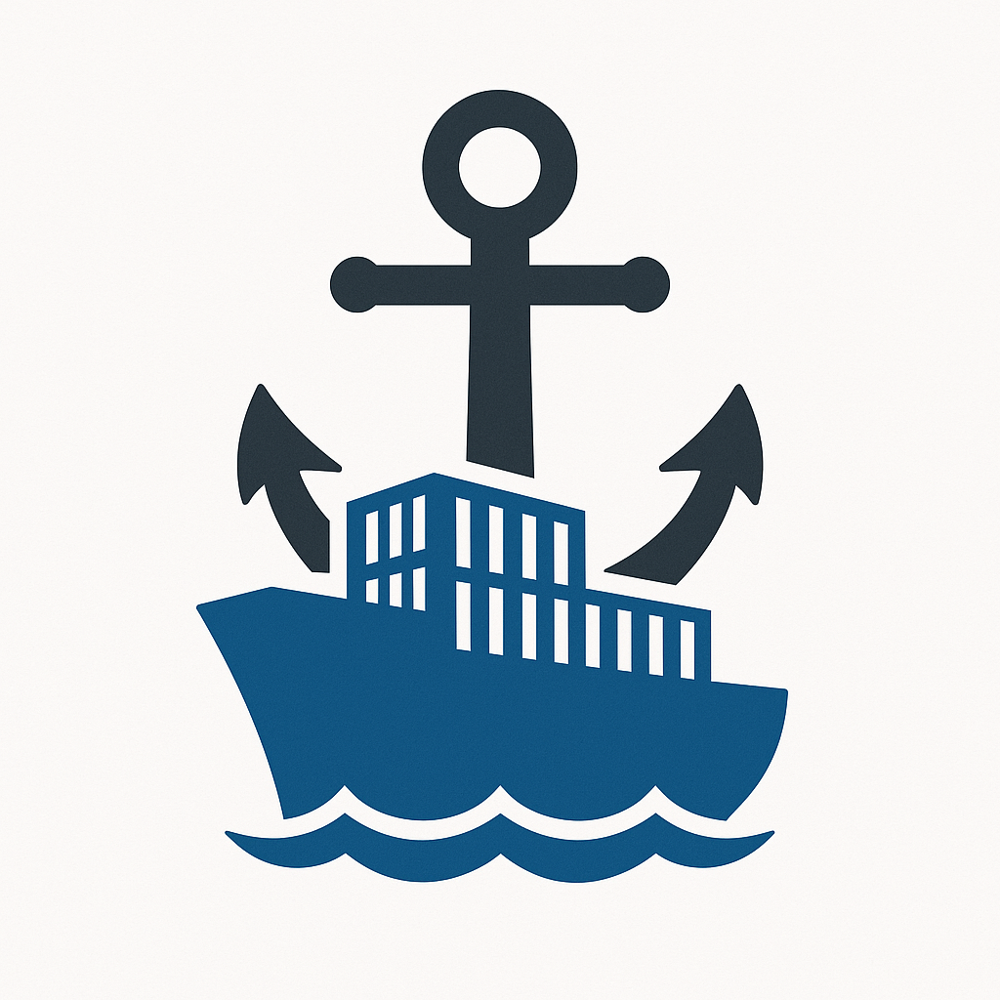

<p align="center" style="font-size: 2.5em">
    Anchor
</p>
<p align="center">
    
</p>
<p align="center" style="font-size: 1.5em">
    Declarative Docker Cluster Management in Rust
</p>

[](https://crates.io/crates/anchor)
[](https://docs.rs/anchor)
[](https://opensource.org/licenses/MIT)

A Rust library for managing Docker container clusters through declarative JSON manifests. Anchor simplifies the process of downloading images, building containers, and orchestrating multi-container applications.

## Features

- **Declarative Configuration**: Define your container cluster using JSON manifests
- **State Management**: Track container states (Waiting, Downloaded, Built, Running)
- **ECR Integration**: Support for AWS ECR credentials
- **Port Management**: Automatic port mapping with uniqueness validation
- **Progress Tracking**: Real-time feedback during cluster operations
- **Error Handling**: Comprehensive error types for debugging

## Quick Start

### 1. Add to Cargo.toml

```toml
[dependencies]
anchor = "0.0.0"
```

### 2. Write a Manifest

```json
{
  "containers": {
    "web": {
      "uri": "docker.io/library/nginx:latest",
      "port_mappings": [[80, 8080]],
      "command": "Run"
    },
    "db": {
      "uri": "docker.io/library/postgres:latest",
      "port_mappings": [[5432, 5432]],
      "command": "Run"
    }
  }
}
```

### 3. Start Your Cluster

```rust
use anchor::prelude::*;

#[tokio::main]
async fn main() -> Result<(), Box<dyn Error>> {
    // Load manifest
    let manifest = Manifest::load("manifest.json")?;

    // Setup Docker client with credentials
    let credentials = get_docker_credentials().await?;
    let client = DockerClient::new(credentials).await?;

    // Create and start cluster
    let mut cluster = Cluster::new(&client, manifest).await?;
    cluster.start(|status| {
        println!("Status: {:?}", status);
    }).await?;

    println!("✅ All containers are ready!");
    Ok(())
}
```

## Core Components

### Manifest

The `Manifest` struct defines your container cluster configuration:

```json
{
  "containers": {
    "web": {
      "uri": "nginx:latest",
      "command": "Run",
      "port_mappings": [[80, 8080]]
    },
    "db": {
      "uri": "postgres:latest",
      "command": "Run",
      "port_mappings": [[5432, 5432]]
    }
  }
}
```

You can also specify a manfest programmatically in Rust:

```rust
let mut manifest = Manifest::empty();

// Add a web server
manifest.add_container(
    "web".to_string(),
    Container {
        uri: "nginx:latest".to_string(),
        command: Command::Run,
        port_mappings: vec![(80, 8080)],
    },
)?;

// Add a database
manifest.add_container(
    "db".to_string(),
    Container {
        uri: "postgres:latest".to_string(),
        command: Command::Run,
        port_mappings: vec![(5432, 5432)],
    },
)?;

// Save to file
manifest.save("manifest.json")?;
```

### Container Commands

- **`Ignore`**: Skip this container entirely
- **`Download`**: Only download the image
- **`Build`**: Download image and create container
- **`Run`**: Download, build, and start the container

### Container States

Anchor tracks each container through these states:

- **`Waiting`**: Initial state, nothing done yet
- **`Downloaded`**: Docker image has been pulled
- **`Built`**: Container has been created from image
- **`Running`**: Container is actively running

### Cluster Operations

```rust
// Create cluster
let mut cluster = Cluster::new(&client, manifest).await?;

// Start all containers with progress callback
cluster.start(|status| match status {
    ClusterStatus::Downloaded(name) => println!("📥 Downloaded: {}", name),
    ClusterStatus::Built(name) => println!("🔨 Built: {}", name),
    ClusterStatus::Running(name) => println!("🚀 Running: {}", name),
    ClusterStatus::Ready => println!("✅ All ready!"),
}).await?;

// Stop all containers
cluster.stop().await?;

// Check current state
println!("{}", cluster); // Displays all container states
```

## Error Handling

Anchor provides detailed error types:

```rust
use anchor::prelude::*;

match result {
    Err(DockerError::ConnectionError(msg)) => {
        eprintln!("Docker connection failed: {}", msg);
    },
    Err(DockerError::ImageError { image, message }) => {
        eprintln!("Image '{}' error: {}", image, message);
    },
    Err(DockerError::ContainerError { container, message }) => {
        eprintln!("Container '{}' error: {}", container, message);
    },
    Ok(_) => println!("Success!"),
}
```

## Examples

### Basic Web Application

```rust
use anchor::prelude::*;

#[tokio::main]
async fn main() -> Result<(), Box<dyn std::error::Error>> {
    let mut manifest = Manifest::empty();

    // Frontend
    manifest.add_container("frontend".to_string(), Container {
        uri: "nginx:alpine".to_string(),
        command: Command::Run,
        port_mappings: vec![(80, 3000)],
    })?;

    // Backend API
    manifest.add_container("api".to_string(), Container {
        uri: "node:18-alpine".to_string(),
        command: Command::Run,
        port_mappings: vec![(8000, 8000)],
    })?;

    // Database
    manifest.add_container("database".to_string(), Container {
        uri: "postgres:15".to_string(),
        command: Command::Run,
        port_mappings: vec![(5432, 5432)],
    })?;

    // Save and start
    manifest.save("web-app.json")?;

    let credentials = get_docker_credentials().await?;
    let client = DockerClient::new(credentials).await?;
    let mut cluster = Cluster::new(&client, manifest).await?;

    cluster.start(|status| {
        println!("🔄 {:?}", status);
    }).await?;

    println!("🌐 Web application running!");
    println!("Frontend: http://localhost:3000");
    println!("API: http://localhost:8000");

    Ok(())
}
```

### Loading from Configuration File

```rust
use anchor::prelude::*;

#[tokio::main]
async fn main() -> Result<(), Box<dyn std::error::Error>> {
    // Load from JSON file
    let manifest = Manifest::load("./config/production.json")?;

    println!("Loaded {} containers", manifest.containers().len());

    // Display configuration
    for (name, container) in manifest.containers() {
        println!("📦 {}: {}", name, container.uri);
        println!("   Command: {}", container.command);
        println!("   Ports: {:?}", container.port_mappings);
    }

    Ok(())
}
```

## Requirements

- Docker installed and running
- Rust 2024 or later
- Network access for image downloads
- Appropriate permissions for Docker operations

## Platform Support

- ✅ Linux
- ✅ macOS
- ✅ Windows (with Docker Desktop)

## Contributing

1. Fork the repository
2. Create a feature branch (`git checkout -b feature/amazing-feature`)
3. Commit your changes (`git commit -m 'Add amazing feature'`)
4. Push to the branch (`git push origin feature/amazing-feature`)
5. Open a Pull Request

## License

This project is licensed under the MIT License - see the [LICENSE](LICENSE) file for details.
